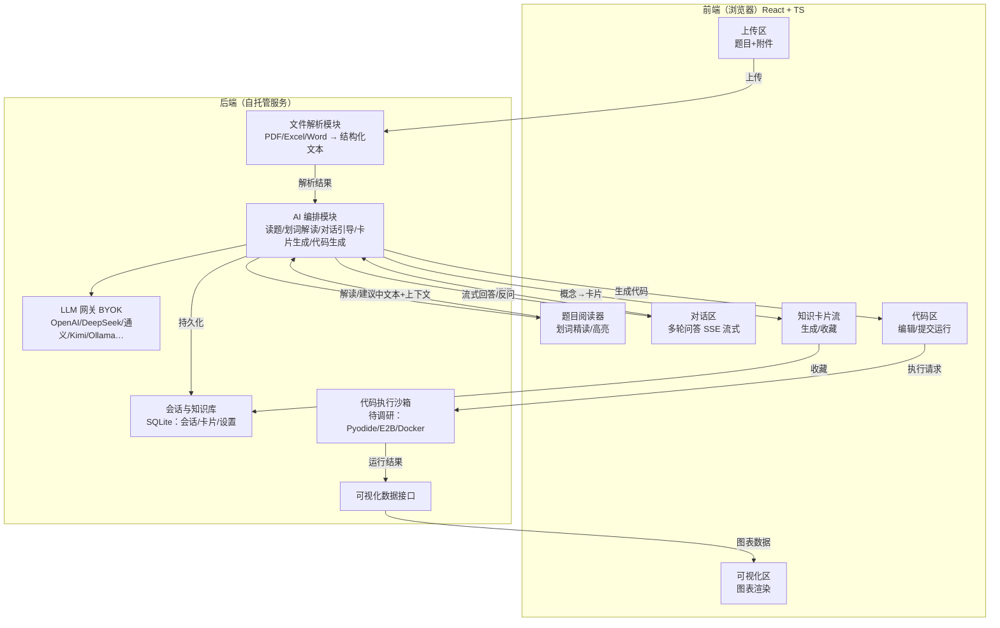

# MMG_VisualizeMM 技术框架与架构（v0.1 · 已并入调研结论）

> 状态：草案 v0.1。基于产品画像 v3 + 竞品调研维度 C（可视化）/ E（开源形态）结论。
> 红色「待调研」决策点已由调研确认并标注 ✅。来源详见 `docs/research/E-开源形态参考.md`、`docs/research/C-数学可视化工具.md`。

---

## 1. 设计原则

| 原则 | 说明 |
|------|------|
| **单用户自托管** | 纯个人工具，无账号体系/协作，本地部署优先，SQLite 级数据量 |
| **BYOK 一切 AI** | 所有 LLM 调用走用户自带 Key，Key 仅存本地；支持多模型供应商自由切换 |
| **AI 是教练不是代笔** | 架构上把「AI 输出」和「用户决策」分离：AI 只生成分析/建议/代码草稿，建模方向与最终决策始终由用户主导 |
| **本地优先、可离线** | 核心功能不依赖外部 SaaS；代码执行优先本地/浏览器内方案 |
| **单语言栈优先** | 尽量用一套语言贯穿前后端，降低自托管维护成本（见下方取舍） |

---

## 2. 技术选型 v0

### 2.1 总览表

| 层 | 选型（已调研确认 ✅） | 备选 | 说明 |
|----|---------|------|-----------|
| 前端框架 | React 18 + TypeScript + Vite | Next.js（若需 SSR/路由收敛） | ai.diy / LibreChat 均为 React 栈，可借鉴 |
| 后端 | **Node.js**（Fastify 或 Next.js API Routes） | Python FastAPI | ✅ 调研确认：ai.diy（浏览器持 Key+中继）与 LibreChat 均为 Node 栈；Pyodide 默认执行时后端无需跑 Python；Docker 沙箱独立服务不受后端语言限制 |
| 数据库 | SQLite（better-sqlite3 / Prisma） | — | 单用户本地场景足够 |
| LLM 网关 | 自研 OpenAI 兼容适配层（多 Provider 直连） | LiteLLM（57.5k⭐，可选内置） | ✅ 采用 LibreChat「自定义端点+预设厂商」双轨模式；Key 存浏览器（ai.diy 架构：localStorage+IndexedDB，AES-GCM 加密，服务器无持久化 Key） |
| 流式响应 | SSE（Server-Sent Events） | WebSocket | — |
| 文件解析 | PDF：pdf-parse / PDF.js；Excel：exceljs；Word：mammoth | Python: pdfplumber/pandas | ⚠️ 表格解析质量是读题功能的地基；参考 Open WebUI 的 Tika/Docling 管线 |
| 代码执行沙箱 | **双轨：Pyodide（默认零部署）+ Docker 沙箱独立服务（生产推荐）** | E2B（用户填 Key 走云沙箱） | ✅ 调研确认：Pyodide 内置 numpy/pandas/scipy/sklearn/matplotlib（数模够用），matplotlib 图自动转 base64 内嵌；Docker 沙箱参考 open-terminal / LibreChat code-interpreter（默认禁外网+工具代理）；演进：单容器→API/Worker/File 分层→microVM |
| 可视化渲染 | **双通道：matplotlib→base64 内嵌 + Plotly/ECharts→iframe 交互** | D3.js（重点卡片后期定制） | ✅ 调研确认：Open WebUI 验证 matplotlib 管线；LibreChat Artifacts 验证 iframe 交互；知识卡片交互演示可用 GeoGebra Activity 嵌入 / Desmos API；数学渲染用 KaTeX |
| 富文本/划词 | 原生 Selection API + 自研高亮层（双向引用：答案→原文高亮 + 划词→发问） | Slate / ProseMirror | ✅ 维度 B 结论：NotebookLM 式溯源 + 通义智文式划词发问 |
| 部署 | Docker Compose 单机一键部署 | 裸 Node 运行 | 参考 NextChat「下载即用、填 Key 就用」的体感 |

### 2.2 关键取舍（已调研确认）

1. **后端语言：Node.js** ✅ —— ai.diy（Key 存浏览器+轻中继，与我们形态最接近）与 LibreChat（MIT）都是 Node 栈；Pyodide 默认执行时后端无需 Python 运行时；Docker 沙箱是独立服务不受语言限制。

2. **代码执行方案：双轨** ✅
   - **轨道 1（默认，零部署）**：Pyodide 浏览器执行 —— Open WebUI / ai.diy 双重验证；matplotlib 出图转 base64/Canvas 捕获内嵌；库集 numpy/scipy/pandas/sklearn/matplotlib 对数模教学场景够用
   - **轨道 2（生产推荐）**：独立 code-execution 服务（Docker 沙箱）—— REST API（参考 open-terminal），容器隔离+资源限制+超时，镜像预装数模全家桶，**默认禁外网+工具调用经代理**（LibreChat 模式）
   - **轨道 3（进阶）**：microVM（libkrun/E2B infra）或用户填 E2B Key 走云沙箱
   - 演进：单容器起步 → 参照 LibreChat code-interpreter 拆 API/Worker/File → 上 microVM

3. **知识卡片存储**：卡片为结构化 JSON（标题/概念/图解/例题/来源），可收藏、可导出；卡片 = 可复用 Skill/模板形态（LibreChat SKILL.md / LobeChat 插件）；知识卡片交互演示嵌入 GeoGebra Activity / Desmos API；教学节奏参考 Seeing Theory（开源 D3 概率统计演示）与 TensorFlow Playground（参数面板金标准）。

4. **许可证红线** ⚠️：**不能直接 fork Open WebUI / LobeChat / Dify 做商用**（均改过自定义许可证，有品牌/商用限制）；MIT 系（LibreChat / AnythingLLM / NextChat / ai.diy / big-AGI）可放心借鉴。建议自研壳 + 借鉴 MIT 系组件。

---

## 3. 系统架构图

### 3.1 逻辑架构



### 3.2 核心流程数据流（用户视角）

```
上传题目+Excel/PDF
   │
   ▼
[文件解析] → 结构化文本(题干 + 表格数据)
   │
   ▼
[AI 读题]  ←── 用户划词 → [划词精读]：这段文字在题目中的地位/信息
   │
   ▼
[对话深挖] 用户提问 → AI 反问引导 → 提出建模方向
   │
   ├──► [知识卡片]：决策树是什么？这题为什么用它？（可收藏）
   │
   ▼
[辅助编程] AI 生成代码草稿 → [沙箱执行] → [可视化渲染]
   │
   ▼
[会话保存] 可回顾 / 卡片沉淀
```

---

## 4. 模块清单（MVP 范围）

| 模块 | 功能 | 优先级 |
|------|------|--------|
| 上传与解析 | 题目文本/图片 + Excel/PDF 附件，结构化提取 | P0 |
| 划词精读 | 任意选中文字 → AI 解读其在题中的地位与信息 | P0（差异化） |
| 对话深挖 | 多轮对话、AI 反问、引导提问 | P0 |
| 知识卡片 | 概念讲解卡片、收藏 | P1 |
| 辅助编程 | AI 生成代码 + 沙箱运行 | P1 |
| 可视化 | 运行结果图表内嵌展示 | P1 |
| 会话管理 | 保存/回顾/删除 | P1 |
| BYOK 设置 | 多模型 Key 管理、模型切换 | P0（形态基础） |

---

## 5. 技术路线总结（调研确认后）

1. **BYOK 层**：浏览器持 Key（ai.diy 架构：localStorage+IndexedDB，AES-GCM 加密，服务器无持久化 Key）+ LibreChat「自定义端点+预设厂商」双轨 + 可选 LiteLLM 网关
2. **代码执行层**：Pyodide（默认零部署）→ Docker 沙箱独立服务（生产推荐）→ E2B/microVM（进阶）
3. **可视化层**：matplotlib→base64 内嵌（默认）+ Plotly/ECharts→iframe 交互（进阶）+ GeoGebra/Desmos 嵌入知识卡片 + KaTeX 数学渲染
4. **产品功能映射**：
   | 产品能力 | 参考实现 |
   |---|---|
   | AI 读题+划词精读 | 文档上传→本地解析（Tika/Docling 管线参考）→上下文注入；划词精读做成 Tool/MCP（Open WebUI Tools 模式），双向引用（答案→高亮 + 划词→发问） |
   | 对话深挖 | 标准 chat + RAG（混合检索+重排）；参考 Vane 联网检索引用；Kimi Deep Research 反问引导范式 |
   | 知识卡片 | 结构化 JSON + 可收藏；GeoGebra/Desmos 嵌入演示；Seeing Theory 教学节奏 |
   | 辅助编程+可视化 | chat→生成代码→code-execution 服务→图表回填内嵌（Open WebUI 管线 + LibreChat Artifacts 交互） |
5. **竞品坐标**：MathModelAgent（3.9k⭐）已验证需求但偏「自动出论文」；我们以「不做论文、专注辅导+可视化+教学交互」差异化
