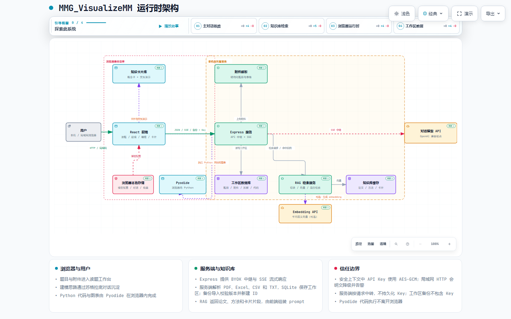
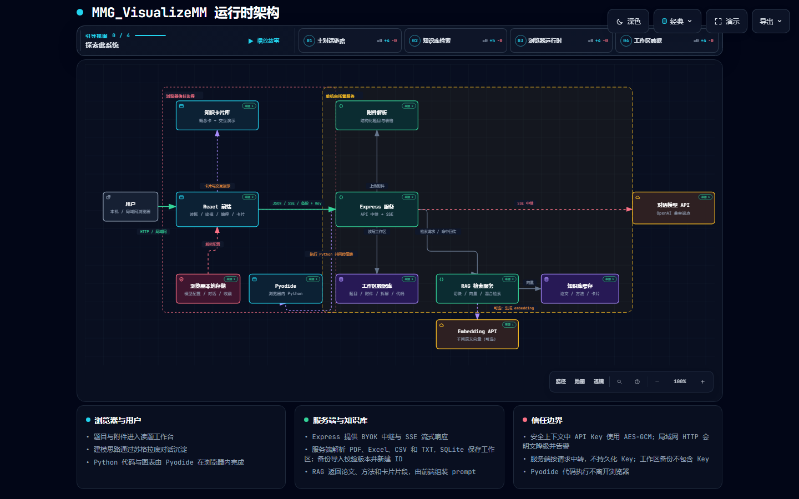
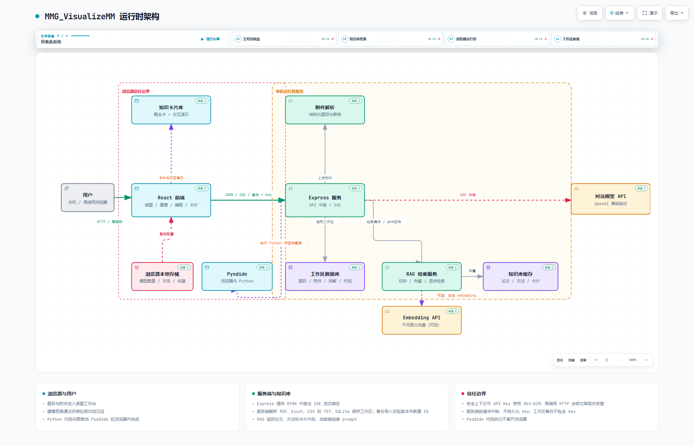
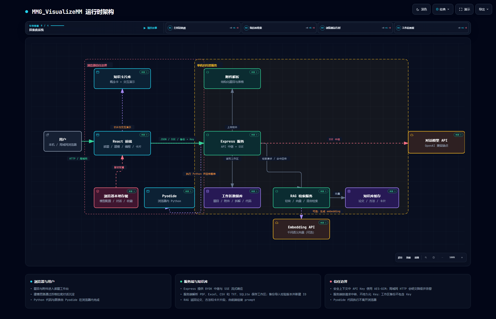

# MMG_VisualizeMM 技术框架与运行时架构

> 状态：当前实现核验版（2026-09-27）。
> 本文以 `web/`、`server/` 和 `package.json` 为事实来源，描述已经存在的运行时组件、数据流与边界；规划中的 Docker 沙箱、独立向量数据库等不计入当前架构。

---

## 1. 当前技术基线

| 层 | 当前实现 | 代码依据 |
|---|---|---|
| 前端应用 | React 18 + Vite 6，JavaScript/JSX；读题、建模、编程和设置共用一个工作区状态 | `web/src/App.jsx`、`web/vite.config.js` |
| 浏览器存储 | `localStorage` 保存模型配置、对话面板状态、收藏、主题和当前工作区 ID；安全上下文中 API Key 使用 WebCrypto AES-GCM | `web/src/store.js`、`web/src/pages/Workbench.jsx`、`web/src/pages/Modeling.jsx` |
| 浏览器计算 | Pyodide 0.26.4 在浏览器内执行 Python，按代码需要加载 numpy、pandas、matplotlib、scipy、scikit-learn，并回收文本输出与 `/plot.png` | `web/src/lib/pyodide.js`、`web/src/pages/Coding.jsx` |
| 服务端 | Node.js + Express 4，默认监听 `0.0.0.0:3088`；提供静态托管、JSON API、SSE 中继、附件解析和工作区 API | `server/index.js` |
| 上游网络 | OpenAI 兼容 `/chat/completions`；支持直连或 HTTP/HTTPS 代理，流式请求由服务端转成 SSE 回传 | `server/index.js`、`server/upstream.js` |
| 工作区存储 | Node 内置 `node:sqlite`，数据库为 `data/mmg.db`；保存题目、分页文本、附件、拆解块、代码和整体解读；数据库及 JSON 备份 schema 当前为 v1 | `server/index.js` |
| 附件解析 | 服务端解析 XLSX、CSV、PDF、TXT/Markdown；PDF 扫描件暂无 OCR，旧版 XLS 需先转换 | `server/index.js` |
| 知识库 | 本地三源 RAG：方法库、知识卡片库、获奖论文；当前扫描为 1251 个知识块，向量缓存写入 `data/knowledge_cache.json` | `server/knowledge.js` |
| Embedding | 可选千问兼容 Embedding API；未配置或调用失败时回退本地 n-gram 哈希向量 | `server/knowledge.js` |
| 知识卡片 | 59 张概念卡，其中 41 张带交互演示；卡片注册表和交互逻辑随前端打包 | `web/src/pages/Cards.jsx` |

## 2. 运行时架构图

- [打开交互式运行时架构图（HTML）](../diagrams/mmg-runtime.architecture.html)
- [查看架构源规格（JSON）](../diagrams/mmg-runtime.architecture.json)

交互图支持浅色/深色、路径追踪、组件聚焦和源码证据查看。下列四张 PNG 是同一份已校验 HTML 在两个桌面视口、两种主题下的静态快照。

| 1440 × 900 · 浅色 | 1440 × 900 · 深色 |
|---|---|
|  |  |

| 2048 × 1320 · 浅色 | 2048 × 1320 · 深色 |
|---|---|
|  |  |

## 3. 组件与边界核验

### 3.1 浏览器信任边界

- React 前端承载读题、建模、编程和卡片交互。
- API Key、模型配置、对话面板状态和收藏保存在浏览器，不写入 SQLite。
- API Key 仅在 HTTPS、`localhost`、`127.0.0.1` 等可用 WebCrypto 的安全上下文中以 AES-GCM 加密；通过普通局域网 HTTP 访问时会降级为明文存储并在设置页告警。
- Python 代码由 Pyodide 在浏览器内执行，服务端没有 Python 执行器、Docker 沙箱或任务队列。

### 3.2 单机自托管服务边界

- Express 同一进程负责 API、静态文件、模型中继、附件解析、工作区读写和 RAG 检索入口。
- `data/mmg.db` 只保存工作区业务数据，不保存 API Key。
- 工作区 JSON 备份只导出业务字段和版本元数据；不包含浏览器中的 API Key、模型设置、对话面板状态或偏好。
- `data/knowledge_cache.json` 是可重建的向量缓存；知识源来自 `docs/07-论文库/`。
- `server/upstream.js` 负责直连或代理传输，并对网络错误做不泄露凭据的归一化。

### 3.3 外部服务边界

- 对话模型是用户配置的 OpenAI 兼容端点；浏览器随单次请求把 Base URL、模型名和 API Key 交给 Express，中继完成后不持久化这些凭据。
- Embedding API 是可选外部依赖。服务端可优先读取 `server/.env.local` 的 Embedding 配置，也可使用请求携带的配置；不可用时继续使用本地哈希向量。
- Pyodide 首次加载依赖 jsDelivr CDN，因此“浏览器内执行”不等于首次使用完全离线。

## 4. 关键数据流

### 4.1 对话与代码生成

1. 前端从本地设置解密 API Key。
2. 前端向 `/api/chat` 或 `/api/chat/stream` 发送 OpenAI 兼容消息与 BYOK 配置。
3. Express 通过 `server/upstream.js` 调用外部模型；流式响应以 SSE 增量回传。
4. 读题、建模和编程页面消费回复；生成的代码仍由用户在浏览器 Pyodide 中运行。

### 4.2 RAG 检索与提示词组装

1. 前端先调用 `/api/knowledge/search`。
2. 服务端对方法库、卡片库和论文块执行“向量相似度 + 关键词 + 类型权重”的混合检索。
3. 服务端返回 top-k 命中片段；前端 `formatKnowledgeContext()` 把片段组装进 system prompt。
4. 前端再把完整 prompt 发送到对话接口。也就是说，RAG 服务负责检索，提示词注入发生在前端。

### 4.3 附件与工作区

1. 浏览器把附件转为 base64，提交 `/api/parse`。
2. 服务端解析 XLSX/CSV/PDF/TXT/Markdown，返回表格或结构化文本。
3. 前端把题目、附件、拆解块、代码和整体解读写入工作区 API，最终落到 `data/mmg.db`。
4. 编程台可从工作区附件接口取得 CSV/JSON，再挂载到 Pyodide 的 `/data` 目录。
5. 用户可把单个工作区导出为 `mmg-workspace-backup` / `schemaVersion: 1` JSON；导入先校验格式与版本，再以新 ID 写入 SQLite，不覆盖已有工作区。

## 5. 当前 API 面

| 能力 | 接口 |
|---|---|
| 模型连通性与对话 | `POST /api/test-key`、`POST /api/chat`、`POST /api/chat/stream` |
| 附件解析 | `POST /api/parse` |
| 工作区 CRUD | `GET/POST /api/workspaces`、`GET/DELETE /api/workspaces/:id` |
| 工作区备份恢复 | `GET /api/workspaces/:id/backup`、`POST /api/workspaces/import` |
| 附件数据导出 | `GET /api/workspaces/:id/attachments/:idx/data.csv`、`data.json` |
| 知识库 | `GET /api/knowledge/stats`、`POST /api/knowledge/search` |
| 健康检查 | `GET /api/health` |

## 6. 当前架构明确不包含

- 服务端 Python/Docker/microVM 代码执行沙箱；
- WebSocket、消息队列或独立 Worker；
- 独立向量数据库；
- 账号、权限和多租户隔离；
- API Key 服务端持久化；
- PDF OCR 和旧版 XLS 解析。

这些能力若后续实现，应在代码、边界和安全约束落地后再进入运行时架构图，不能用规划替代现状。
